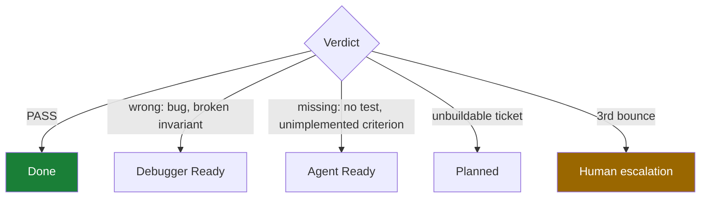

# skills

Agent skills for running software work as a **factory** rather than a conversation — plus `vskills`, a zero-dependency installer that puts them on your machine.

A skill is a file an agent loads on demand that says *how to do one job properly*. This repo holds two kinds: a four-stage delivery pipeline where no agent is ever allowed to review its own work, and a library of standalone skills for the jobs around it.

```
npx github:VrajGupta/skills init
```

---

## Why not just prompt?

You already can prompt an agent to "build this feature and test it." It usually works. The failures are the problem — and they are the *same* failures every time.

| What goes wrong when you prompt | Why it happens | What a skill does instead |
|---|---|---|
| Agent says "done", the tests were never run | "Done" is a feeling, judged by the same model that wants to be finished | Done is a **locked command that must exit 0**, run *after* the final edit |
| Agent reviews its own code and approves it | The misreading that produced the bug produces a confident review of the bug | The reviewer is a **different model in a different context**, and never reads the author's rationale |
| A ticket bounces between build and fix forever | Nobody is allowed to say "this ticket is unbuildable" | Three failed reviews **escalate to a human** instead of looping |
| Second session has no idea what the first did | Chat history is not a handoff | State lives on the **board**; evidence lives on the **issue** |
| Parallel agents overwrite each other | No one drew the boundaries | Explicit **file lanes**, and the parent re-runs every gate itself |
| "I fixed the edge cases" (it did not) | Happy path is green, so the suite says yes | A dedicated stage attacks **only** the corners the happy path never touches |

The thread running through all of it: **a claim is not evidence.** Nearly every rule in this repo exists to convert some claim into something checkable.

<details>
<summary><b>The single most important idea, if you read nothing else</b></summary>

<br>

**Maker ≠ checker, structurally.**

Not "the agent should double-check its work" — that fails, because the same context that made the mistake evaluates the mistake. Instead:

- The **coder** builds it and is explicitly forbidden from judging it.
- The **debugger** attacks it on a different model, may fix anything, but may not close it.
- The **reviewer** judges it blind on a *third* model — diff, ticket, and invariants only. It never reads the handoff, because a confident narrative from the author is the strongest single contaminant of a review. It is also the only stage permitted to mark anything `Done`.

Everything else is plumbing around that one property.

</details>

---

## The pipeline


| Stage | Skill | Owns | May set `Done`? |
|---|---|---|---|
| Plan | `/planner` | Grill → invariants → spec → tickets | No |
| Build | `/coder` | One ticket, test-first, against a gate | No |
| Harden | `/debugger` | Attack the corners, fix test-first | No |
| Judge | `/reviewer` | Blind verdict, route by failure kind | **Yes — only this one** |

Each stage runs in its own top-level session on a **different model**, so no stage inherits the previous one's blind spots. The GitHub Project item, the issue, git, and the handoff are what connect them — never chat history.

<details>
<summary><b>/planner</b> — turn a fuzzy idea into tickets a stranger could build</summary>

<br>

**Use it when:** you have a feature, ADR, or "we should probably…" and no tickets yet.

**What it does:**

1. **Sizes the effort.** Too big or too foggy to even name the open questions? It recommends `/wayfinder` to map the territory first, rather than grilling fog.
2. **Grills you.** Interactively challenges the plan against your project's existing docs and decisions until every load-bearing fork is settled.
3. **Locks invariants** — the step most plans skip. Concrete latency budgets (`p95 < 300ms`, not "fast"), failure-mode contracts for every dependency, and security/permission boundaries. These become the targets `/debugger` attacks and the criteria `/reviewer` grades.
4. **Writes a spec**, then breaks it into dependency-ordered vertical slices.
5. **Publishes real tickets** — each with acceptance criteria a *blind* reviewer can check, and a runnable `Verification-command`.

**Why it helps:** a vague ticket does not fail at planning time. It fails three stages later as a ticket that bounces forever because nobody can tell whether it's satisfied. This stage writes for those three future readers.

**Uses:** `grill-with-docs` → `to-spec` → `to-tickets` → `handoff` → `push-handoff`

</details>

<details>
<summary><b>/coder</b> — build exactly one ticket, honestly</summary>

<br>

**Use it when:** there's a ticket in `Agent Ready` and you want it built.

**What it does:**

1. Picks the **lowest-numbered unblocked ticket** (preferring one the reviewer bounced back — that work is half-built and blocking a close).
2. Moves *only that ticket* to `Coding`, so the board answers "what is an agent touching right now."
3. **Locks the gate** — one command that must exit 0 — before writing any code.
4. Builds test-first at the highest meaningful seam, with external dependencies faked.
5. **Self-checks narrowly:** every acceptance criterion named against the line and test that satisfies it; every invariant given a test that would go red if it broke.
6. Moves to `Debugger Ready` and writes an honest handoff — including what is stubbed.

**Why it helps:** it is deliberately *not* the checker. It cannot talk the reviewer into a pass, because the reviewer never reads its handoff. That removes the incentive to write defensively and replaces it with the only thing that works: a green gate and an honest report.

**"Build all of them"** drains the queue **serially** — one ticket in `Coding` at a time, re-querying the board each lap. Parallel is available but requires explicit authorization and provably disjoint file lanes.

</details>

<details>
<summary><b>/debugger</b> — the skeptic</summary>

<br>

**Use it when:** something is in `Debugger Ready`, or you want an audit of code nobody filed bugs against.

**Four nets**, stated in full before a single fix:

1. **Failing tests** — what is already red
2. **Static errors** — typechecker and linter
3. **Invariant violations** — does the *code* actually honor each budget, failure contract, and trust boundary? Real reading, not a grep.
4. **Weak tests** — invariants with no covering test, tautological or over-mocked tests that assert nothing. *A missing test for an invariant is itself a bug.*

**Then it red-teams the corners** — the pass `/coder` deliberately skipped, and it does **not** re-run the happy path:

- Weird inputs: empty, null, zero, negative, oversized, malformed, unicode, duplicate, injection-shaped, timezone boundaries
- Failure modes: each dependency down, slow, rate-limited, returning garbage — *"a `try/catch` that logs and continues is usually a broken failure mode wearing the costume of a handled one"*
- Sequences: races, retry after partial success, the same webhook twice, a crash between the write and the publish
- Boundaries: wrong user, forged token, another tenant's identifier

It may fix anything it finds. It may **not** close anything — it just became an author.

**Bootstraps a per-repo auditor agent** (`.claude/agents/debugger-<slug>.md`) pinned to your stack, test globs, gate command, and invariant docs. Created once, reused verbatim after.

</details>

<details>
<summary><b>/reviewer</b> — the gate, and the only stage that says no</summary>

<br>

**Use it when:** something is in `Review Ready`.

**Reads exactly three things:** the diff, the ticket, the invariant docs.

**Refuses to read:** the handoff, the PR description, commit-message justifications, any agent transcript explaining *why* the code is correct.

> Once you have read "this is safe because we validate upstream," you will look for that validation and see it, whether or not it is there.

**Cheap checks first.** Gate red → immediate fail, no judgment pass. Deterministic checks are cheaper and more reliable than a model; let them do their half.

**Then six dimensions** — ticket fidelity, invariant integrity, test honesty, corner behavior, domain fit, craft. The first four can block. The last two only advise unless you can name a concrete future failure, *because a reviewer empowered to block on taste will block forever and the fleet will learn to route around it.*

**Every finding must be falsifiable:** `file:line` + the input that triggers it + the wrong behavior. "Error handling could be more robust" is not a finding — it cannot be argued with, so it cannot be fixed, so it bounces the ticket forever.

**Routes by failure kind**, not into one default lane:



That fourth row is the one most setups forget, and it is the origin of most infinite loops: a ticket that *cannot* be satisfied bounced forever between builder and fixer, each doing competent work on an impossible task.

It also **never fixes what it grades.** The moment the judge starts authoring, there is no independent judge left anywhere in the loop.

</details>

---

## Built to production standards

This is the discipline you would apply to code that pages you at 3am, applied to the process that writes it. Every claim below is checkable in this repo right now.

| Standard | How it's held |
|---|---|
| **Nothing ships unverified** | Every ticket carries a `Verification-command` that must exit 0, run *after* the final edit — not before, not "probably still passing" |
| **Independent sign-off** | The reviewer is a different model in a different context, reads only diff + ticket + invariants, and is the sole stage permitted to mark `Done` |
| **Non-functionals are contracts** | Latency budgets, failure-mode behavior, and trust boundaries are locked *before* the spec, then attacked in a dedicated stage and graded against |
| **Failures terminate** | Three failed reviews escalate to a human instead of ping-ponging a ticket that cannot be satisfied |
| **State is auditable** | The board holds status, the issue holds evidence with verbatim gate output and commit SHA — reconstructable months later without chat logs |
| **Concurrency is bounded** | Parallel agents get explicit file lanes, may not commit, and the parent re-runs every gate itself |
| **Deploys are proven** | `push-handoff` refuses to claim success without reading the remote SHA back, never force-pushes, and scans the diff for secrets |

The tooling holds the same bar. `vskills` ships **zero runtime dependencies** and **35 tests** covering install, drift detection, dependency resolution, symlink safety, and the npx entrypoint. Copies stage into a temp dir and swap in via `rename`, so an interrupted install cannot leave a half-written skill. Content is hashed, so a skill you hand-edited is detected as drifted and left alone rather than silently overwritten. Destructive overwrites are backed up first. The guarantees are written down and held to in [`docs/invariants.md`](docs/invariants.md).

<details>
<summary><b>What each mechanism buys, and what it costs</b></summary>

<br>

No mechanism here is free. Each row is the honest trade.

| Mechanism | Failure it removes | Costs you |
|---|---|---|
| Locked `Verification-command` run after the final edit | "Done" claimed on tests that were never run | Nothing — this one is strictly free |
| Blind review on a different model | Self-approved bugs. The single largest win. | A second model's tokens |
| Invariants locked *before* the spec | Plans optimized for "finish" instead of "safe" | One interactive planning session |
| Dedicated corner-attack stage | Edge cases nobody considered at build time | A whole extra stage |
| Bounce budget → human at 3 | Infinite build/fix loops on impossible tickets | An occasional human interrupt |
| Board state + evidence on the issue | Session two re-deriving session one | Discipline about tracker writes |
| File lanes for parallel work | Agents silently overwriting each other | Drawing boundaries up front |

Overall you are trading **tokens and time-to-first-"done"** for **defects that never reach you**. That trade is excellent on a payments integration or an auth boundary, and poor on a script you are deleting tomorrow.

**If you adopt one thing:** lock a verification command before the work starts and require it to be run after the final edit. Most false "done" claims disappear and it costs nothing.

**If you adopt two:** have a *different model* review the diff without reading the author's explanation.

</details>

<details>
<summary><b>When NOT to use this</b></summary>

<br>

Knowing where a tool stops is part of what makes it trustworthy inside its range.

- **Throwaway scripts, spikes, prototypes.** Use `/prototype`. The pipeline's overhead buys nothing when the code is going in the bin.
- **One-line fixes.** Four stages for a typo is theater.
- **Exploratory work where you don't know the question yet.** Use `/wayfinder` to map it first, or `/research`. Grilling fog produces confident nonsense.
- **Solo hacking where you *are* the checker and you're actually going to read it.** The pipeline's value is proportional to how little you plan to read.
- **No test suite at all.** The gate is the backbone. Without one, every "done" is a judgment call again and most of the machinery is inert.

</details>

---

## "I want to…" — start here

| I want to… | Use |
|---|---|
| Take an idea all the way to tickets | `/planner` |
| Build the next ready ticket | `/coder` |
| Find bugs in code an agent wrote | `/debugger` |
| Decide if work can close | `/reviewer` |
| Run a blind loop against a real quality bar | `/gauntlet-loop` |
| Run *any* task until a checker says done | `/loop-engineer` |
| Stress-test a plan before building | `/grilling`, `/grill-me` |
| Map work too big to hold in one session | `/wayfinder` |
| Debug something genuinely hard | `/diagnosing-bugs` |
| Audit a whole codebase, not one diff | `/codebase-audit` |
| Check an invariant is *enforced*, not just documented | `/invariant-evidence-review` |
| Work on several tickets at once | `/parallel-subagent-implementation` |
| Deliver a whole ticket range in order | `/subagent-batch-implementation` |
| Ship a webhook / queue / billing integration | `/provider-integration-tdd` |
| Price a feature whose cost is inference | `/ai-subscription-unit-economics` |
| Unstick a pipeline reporting false progress | `/state-driven-pipeline-recovery` |
| Hand off to the next session | `/handoff` then `/push-handoff` |
| Write a skill of my own | `/writing-great-skills` |

---

## Full catalog

<details>
<summary><b>Pipeline machinery</b> — how tickets move and what counts as proof</summary>

<br>

`planner` / `coder` / `debugger` / `reviewer` are the chains you *run*. `pipeline/` is the machinery around them.

| Skill | Use when |
|---|---|
| `github-projects-pipeline` | The stage protocol. Project `Status` is canonical; issues hold tickets and evidence. Load before any stage. |
| `profile-gated-delivery` | Run an effort end to end with an evidence gate between every stage |
| `specialist-profiles` | Build and verify the four role agents so maker ≠ checker is structural, not aspirational |
| `state-driven-pipeline-recovery` | The pipeline is thrashing, or a worker reports success while nothing changed |
| `controlled-ticket-delivery` | Budget caps, live migrations, restricted git or tracker access |
| `ticket-implementation-tdd` | The detailed one-ticket TDD loop `/coder` invokes |
| `provider-integration-tdd` | Queues, signed webhooks, idempotent billing, owned artifacts — where failures are replay and ordering, not logic |
| `invariant-evidence-review` | Is this invariant actually enforced and measured, or just asserted in a comment? |
| `codebase-audit` | Audit a whole system: sweep by layer, rank by blast radius, emit tickets |
| `shared-worktree-safety` | Another agent or human is writing to the same checkout |
| `shared-worktree-delegation` | Fanning subagents into one tree with explicit file lanes |
| `parallel-subagent-implementation` | **Start here for any fan-out** — carries the route table for all parallel work |
| `subagent-batch-implementation` | An authorized ticket *range* delivered in dependency waves |
| `ai-subscription-unit-economics` | Pricing and usage caps when inference is your cost of goods |

The load-bearing rule across all of them: **done is a locked verification command that was actually run after the final change**, plus an independent checker for non-trivial work, plus truthful tracker state.

</details>

<details>
<summary><b>Standalone skills</b> — useful with or without the pipeline</summary>

<br>

| Skill | What it's for |
|---|---|
| `loop-engineer` | Wrap any task in a closed maker→checker loop with an explicit done-condition |
| `gauntlet-loop` | Generate or run a blind maker→critic loop against a real quality bar for one-shot, UI, writing, and implementation work |
| `push-handoff` | Commit and push under explicit authority, and **prove** it by reading the remote SHA back |
| `setup-obsidian` | Turn a docs folder into a retrieval graph — router, generated indexes, state file |
| `setup-vskills` | Set this repo up on a new machine |

`/gauntlet-loop` is the lightweight path for work that does not need the full
planner → coder → debugger → reviewer pipeline. Use it for one-shot prompts, UI
polish, writing, research, or small implementation tasks:

```text
/gauntlet-loop build a landing page for my running brand
```

It first requires a named, fetchable comparison bar. In prompt mode it returns a
paste-ready prompt; in run mode it loops a maker and a fresh critic until the output
wins the blind comparison and its normal verification gate passes. UI work also gets
same-viewport screenshots, responsive states, accessibility, typography, and
interaction checks. It never replaces the debugger or reviewer for security,
permissions, payments, migrations, or other high-risk work.

</details>

<details>
<summary><b>mattpocock/</b> — mirrored library, use independently</summary>

<br>

[mattpocock/skills](https://github.com/mattpocock/skills), MIT licensed — see `mattpocock/LICENSE`. Mirrored by his own category structure. Each is independent; invoke whichever fits the moment.

**engineering/** — `tdd` · `code-review` · `diagnosing-bugs` · `codebase-design` · `domain-modeling` · `grill-with-docs` · `implement` · `improve-codebase-architecture` · `prototype` · `research` · `resolving-merge-conflicts` · `to-spec` · `to-tickets` · `triage` · `wayfinder` · `ask-matt`

**productivity/** — `grilling` · `grill-me` · `handoff` · `teach` · `writing-great-skills`

**misc/** — `git-guardrails-claude-code` · `migrate-to-shoehorn` · `scaffold-exercises` · `setup-pre-commit`

**personal/** — `edit-article` · `obsidian-vault`

**in-progress/** and **deprecated/** are mirrored as-is; treat accordingly.

Run `setup-matt-pocock-skills` once per repo before using the engineering skills — it configures the issue tracker, triage labels, and domain-doc layout they assume.

See `mattpocock/UPSTREAM-README.md` for his full reference and the philosophy behind them.

</details>

---

## Installing with `vskills`

```bash
npx github:VrajGupta/skills init               # install every skill
npx github:VrajGupta/skills list               # what's installed / drifted
npx github:VrajGupta/skills add <skill>        # one skill + its dependencies
npx github:VrajGupta/skills update [skill...]  # refresh (skips your local edits)
```

Content is copied to `~/.agents/skills/<name>` and symlinked into `~/.claude/skills/<name>`.

<details>
<summary><b>What it guarantees</b></summary>

<br>

- **Your edits are safe by default.** If an installed skill's content hash doesn't match the manifest, it's `drifted` and left untouched. Only `--force` overwrites it.
- **Destructive overwrites get backed up first**, to `~/.agents/skills/.vskills-backup/<name>-<timestamp>`.
- **Interrupted copies never corrupt.** Staged in a temp dir, swapped in with `rename`.
- **Symlinks are never clobbered.** A real directory or a foreign symlink at the target path is left alone with a warning.

Zero runtime dependencies, Node ≥18. Full design in [`docs/spec-vskills-cli.md`](docs/spec-vskills-cli.md); the guarantees it holds itself to are in [`docs/invariants.md`](docs/invariants.md).

</details>

---

## Layout

```
bin/vskills.js    the vskills CLI entrypoint
src/              vskills implementation
test/             vskills test suite (node --test)

planner/          plan    — grill → invariants → spec → tickets → handoff
coder/            build   — next ticket → TDD → self-check → handoff
debugger/         harden  — four-net audit → red-team the corners → fix
reviewer/         judge   — blind verdict → PASS/FAIL → route or escalate

push-handoff/     verified, explicitly authorized commit/push closeout
loop-engineer/    closed maker→checker loop runner
gauntlet-loop/    blind maker→critic loop for one-shot and UI work
pipeline/         the machinery: stage protocol, roles, worktree safety,
                  batch delivery, audit, recovery
mattpocock/       mirrored library (github.com/mattpocock/skills)
```

<details>
<summary><b>Running the stages on different models</b></summary>

<br>

The pipeline is serial. Each stage runs as an independent top-level session; a stage may coordinate one level of helpers, and a helper may never spawn helpers of its own.

| Stage | Default parent | Harness | Effort |
|---|---|---|---|
| `/planner` | Opus 5 | Claude Code | medium/high |
| `/coder` | Kimi K3 | Pi via OpenRouter | high |
| `/debugger` | GPT-5.6 Luna | Codex | **max** |
| `/reviewer` | Grok 4.5 | Pi via OpenRouter | high/xhigh |

These are defaults, and a project's own CONTEXT may override them. **What is not negotiable** is that the reviewer is a different model and context from whoever produced the diff. If that can't be confirmed, the verdict must say so rather than quietly proceeding.

The board item, issue, git artifacts, and handoff bridge the sessions — never chat history. `max` is a reasoning setting, not part of a model name. A headless planner cannot conduct the interactive grill; use a visible session or supply every decision in advance.

**Runtime.** super.engineering is the managed-workspace authority for worktrees, target/base branches, sessions, and reviews. Herdr is an optional local terminal multiplexer giving you visible, persistent agent panes, and it can host the separate stage-parent processes. The two coexist — super.engineering owns the workspace, Herdr provides process visibility — but Herdr replaces neither GitHub Projects nor git, and should not independently mutate a super.engineering-managed worktree.

**No GitHub Project?** Every stage still runs in full — grill, build, attack, judge — recording state in a local tracker or the handoff instead. A missing label is a bookkeeping gap; a skipped test is a defect that ships. The stage protocol, including the no-project fallback, is in [`pipeline/github-projects-pipeline`](pipeline/github-projects-pipeline/SKILL.md).

</details>
